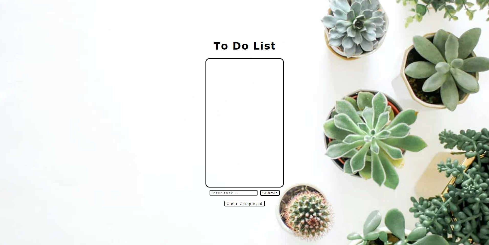
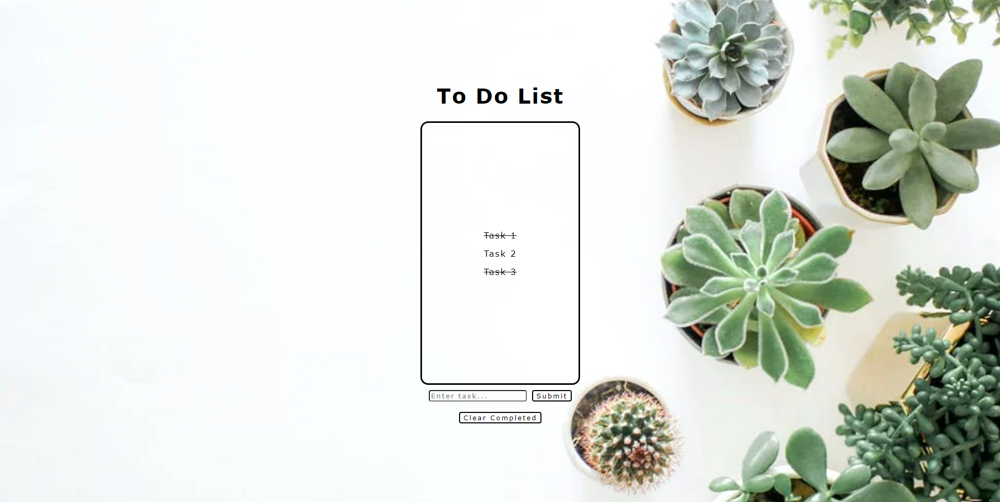

# To Do List
A simple front-end single page React To-Do List application that allows to add, delete, and cross out tasks. 

## Technology

- Built with React.js, HTML, CSS.

## Screenshots 
### To Do List

### Add Tasks

### Cross Out Tasks

### Delete Crossed Out Tasks

